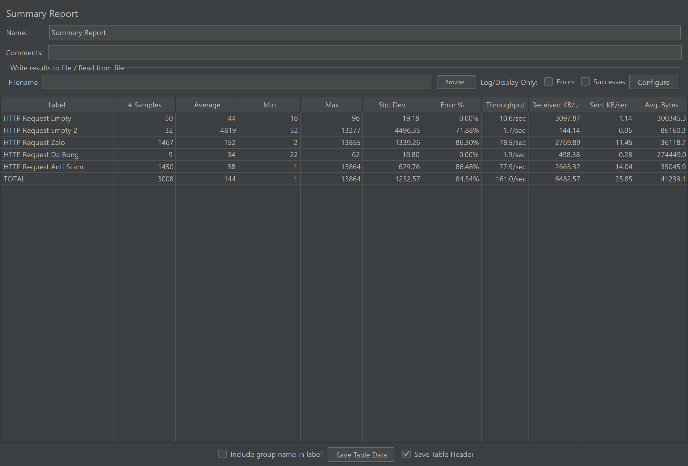

# Kiểm Thử Phần Mềm - SOFT4003

> [!NOTE]
> **Sinh viên thực hiện:** Trần Việt Anh
>
> **MSSV:** BCS230111
>
> **Lớp:** 23CS-GM

Dự án tập trung vào các bài tập và ứng dụng thực tế về kiểm thử phần mềm, bao gồm kiểm thử đơn vị, kiểm thử tĩnh, và kiểm thử tự động End-to-End.

---

## Mục Lục

1. [Bài 1: Nguyên lí của Kiểm Thử](#bài-1-nguyên-lí-của-kiểm-thử)
2. [Bài 2: Quy Trình Kiểm Thử - Unit Test](#bài-2-quy-trình-kiểm-thử---unit-test)
3. [Bài 3: Kiểm Thử Tự Động - Cypress](#bài-3-kiểm-thử-tự-động---cypress)

---

## Bài 1: Nguyên Lí Của Kiểm Thử

**Mục tiêu:** Hiểu rõ các nguyên lí cơ bản trong kiểm thử phần mềm thông qua bài tập tương tác.

| Thông tin              | Chi tiết                                |
| ----------------------- | ---------------------------------------- |
| Đường dẫn bài tập | [Can&#39;t Unsee](https://cantunsee.space/) |
| Số lần thực hiện    | 3                                        |
| Ngày thực hiện       | 05/01/2026                               |


---

## Bài 2: Quy Trình Kiểm Thử - Unit Test

### Mô Tả Bài Toán

#### Script StudentAnalyzer.js dùng để phân tích điểm số học sinh với hai chức năng chính:

**1. countExcellentStudents**

- Đếm sinh viên xuất sắc
- Đếm số sinh viên có điểm ≥ 8.0
- Chỉ xử lý các giá trị hợp lệ trong khoảng [0, 10]
- Bỏ qua giá trị trống `(null)` hoặc ngoài phạm vi

**2. calculateValidAverage**

- Tính điểm trung bình
- Tính trung bình của các điểm hợp lệ trong [0, 10]
- Bỏ qua giá trị trống `(null)` hoặc không hợp lệ
- Trả về 0 nếu không có điểm nào hợp lệ

### Công Nghệ Sử Dụng

| Công Nghệ | Phiên Bản | Mô Tả                                     |
| ----------- | ----------- | ------------------------------------------- |
| Java        | 8+          | Ngôn ngữ lập trình chính               |
| Maven       | 3.6+        | Công cụ quản lý dự án và phụ thuộc |
| JUnit       | 5           | Framework kiểm thử đơn vị              |

### Hướng Dẫn Chạy Chương Trình

#### Yêu Cầu Hệ Thống

- **Java Development Kit (JDK)** phiên bản 8 trở lên
- **Maven** phiên bản 3.6 trở lên

#### Bước Chuẩn Bị

**1. Cài Đặt Java JDK**

- Tải JDK từ [Oracle](https://www.oracle.com/java/technologies/downloads/) hoặc [OpenJDK](https://openjdk.java.net/)
- Cài đặt và thiết lập biến môi trường `JAVA_HOME`

**2. Cài Đặt Maven**

**Cách 1: Cài đặt thủ công (tất cả hệ điều hành)**

- Tải từ https://maven.apache.org/
- Giải nén và lưu vào thư mục yêu thích
- Thiết lập biến `MAVEN_HOME`
- Thêm `%MAVEN_HOME%\bin` (Windows) hoặc `$MAVEN_HOME/bin` (Linux/Mac) vào `PATH`

**Cách 2: Sử dụng Chocolatey (Windows)**

```bash
winget install -e --id Chocolatey.Chocolatey
choco install maven
```

**3. Kiểm Tra Cài Đặt**

```bash
java -version
mvn -version
```

---

#### Tải và Chạy Dự Án

**Tải dự án**

```bash
git clone <đường-dẫn-repo>
cd unit-test
```

**Biên Dịch Dự Án**

```bash
mvn clean compile
```

**Chạy Tất Cả Ca Kiểm Thử**

```bash
mvn test
```

**Chạy Kiểm Thử Cụ Thể**

```bash
mvn test -Dtest=StudentAnalyzerTest#testCountExcellentStudents_normalCase
```

**Xem Kết Quả Kiểm Thử**

Báo cáo chi tiết được lưu tại: `unit-test/target/surefire-reports/`

| File                             | Mô Tả        |
| -------------------------------- | -------------- |
| `TEST-StudentAnalyzerTest.xml` | Báo cáo XML  |
| `StudentAnalyzerTest.txt`      | Báo cáo text |

### Danh Sách Ca Kiểm Thử

#### Tổng Quan

Dự án có **26 ca kiểm thử tối ưu** chia thành các nhóm:

| Nhóm Kiểm Thử | Số Lượng | Mô Tả |
| --- | --- | --- |
| Kiểm thử cơ bản | 13 | Kiểm thử null, rỗng, all valid/invalid, có null elements |
| Kiểm thử giá trị biên | 7 | Kiểm thử ranh giới (8.0, 10.0) với precision cao |
| Kiểm thử phân vùng tương đương | 6 | Phân chia các vùng giá trị điển hình |

#### Chi Tiết Các Ca Kiểm Thử

##### A. Kiểm Thử Cơ Bản `countExcellentStudents` (6 tests)

| Tên Ca Kiểm Thử | Dữ Liệu | Kết Quả |
| --- | --- | --- |
| `testCountExcellentStudents_nullList` | null | 0 |
| `testCountExcellentStudents_emptyList` | [] | 0 |
| `testCountExcellentStudents_allExcellent` | [8.0, 9.5, 10.0] | 3 |
| `testCountExcellentStudents_noneExcellent` | [5.0, 6.0, 7.0] | 0 |
| `testCountExcellentStudents_mixedWithNull` | [8.5, null, 9.0, 7.0] | 2 |
| `testCountExcellentStudents_allNulls` | [null, null, null] | 0 |

##### B. Kiểm Thử Giá Trị Biên `countExcellentStudents` (3 tests)

| Tên Ca Kiểm Thử | Dữ Liệu | Kết Quả | Mục Đích |
| --- | --- | --- | --- |
| `testCountExcellentStudents_boundary_lowerLimit` | [7.9, 7.99, 8.0] | 1 | Kiểm tra cận dưới 8.0 |
| `testCountExcellentStudents_boundary_upperLimit` | [10.0, 10.0001, 10.01] | 1 | Kiểm tra cận trên 10.0 |
| `testCountExcellentStudents_boundary_precision` | [10.00001, 10.0000001] | 0 | Kiểm tra sai số precision |

##### C. Phân Vùng Tương Đương `countExcellentStudents` (5 tests)

| Tên Ca Kiểm Thử | Vùng | Dữ Liệu | Kết Quả |
| --- | --- | --- | --- |
| `testCountExcellentStudents_equivalence_lowExcellent` | [8.0-10.0] | [8.0] | 1 |
| `testCountExcellentStudents_equivalence_midExcellent` | [8.0-10.0] | [9.0] | 1 |
| `testCountExcellentStudents_equivalence_highExcellent` | [8.0-10.0] | [10.0] | 1 |
| `testCountExcellentStudents_equivalence_nonExcellent` | [0.0-7.9] | [0.0, 5.0, 7.9] | 0 |
| `testCountExcellentStudents_equivalence_invalid` | <0 hoặc >10 | [-5.0, 12.5] | 0 |

##### D. Kiểm Thử Cơ Bản `calculateValidAverage` (7 tests)

| Tên Ca Kiểm Thử | Dữ Liệu | Kết Quả |
| --- | --- | --- |
| `testCalculateValidAverage_nullList` | null | 0.0 |
| `testCalculateValidAverage_emptyList` | [] | 0.0 |
| `testCalculateValidAverage_allValid` | [0.0, 5.0, 10.0] | 5.0 |
| `testCalculateValidAverage_someValid` | [5.0, -1.0, 10.0, 11.5] | 7.5 |
| `testCalculateValidAverage_allInvalid` | [-5.0, 11.0, 20.0] | 0.0 |
| `testCalculateValidAverage_withNulls` | [null, 6.0, null, 8.0] | 7.0 |
| `testCalculateValidAverage_allNulls` | [null, null, null] | 0.0 |

##### E. Kiểm Thử Giá Trị Biên `calculateValidAverage` (4 tests)

| Tên Ca Kiểm Thử | Dữ Liệu | Kết Quả | Mục Đích |
| --- | --- | --- | --- |
| `testCalculateValidAverage_boundary_exactBounds` | [0.0, 10.0] | 5.0 | Kiểm tra đúng ranh giới |
| `testCalculateValidAverage_boundary_outsideBounds` | [-0.01, 0.0, 10.0, 10.01] | 5.0 | Loại trừ ngoài ranh giới |
| `testCalculateValidAverage_boundary_precision` | [5.0, 10.0001, 10.0000001] | 5.0 | Phát hiện sai số $10^{-4}$ đến $10^{-7}$ |
| `testCalculateValidAverage_boundary_mixedPrecision` | [9.9999, 10.0, 10.0001] | 9.99995 | Kiểm tra tổ hợp precision |

##### F. Phân Vùng Tương Đương `calculateValidAverage` (1 test)

| Tên Ca Kiểm Thử | Dữ Liệu | Kết Quả |
| --- | --- | --- |
| `testCalculateValidAverage_equivalence_mixedScores` | [9.0, 8.5, 7.0, 11.0, -1.0] | 8.17 |


**Kết quả:** `26 tests` đã được triển khai thành công, bao gồm kiểm thử cơ bản, giá trị biên, và phân vùng tương đương.

#### Khả Năng Phát Hiện Lỗi

**Mutation Testing:**
- Thay đổi `<= 10.0` → `<= 10.0000001`: **1 test FAIL** 
  - `testCalculateValidAverage_boundary_precision` phát hiện lỗi
- Thay đổi `>= 8.0` → `>= 7.5`: **1 test FAIL** 
  - `testCountExcellentStudents_boundary_lowerLimit` phát hiện lỗi

**Coverage:** 3 kỹ thuật kiểm thử - Boundary Value Analysis, Equivalence Partitioning, Decision Table Testing

#### Chi Tiết Các Ca Kiểm Thử

##### A. Kiểm Thử Cơ Bản `countExcellentStudents` (6 tests)

| Tên Ca Kiểm Thử | Dữ Liệu Thử Nghiệm | Mô Tả |
| --- | --- | --- |
| `testCountExcellentStudents_equivalence_lowNonExcellent` | 0.0 | Cận dưới vùng không xuất sắc |
| `testCountExcellentStudents_equivalence_midNonExcellent` | 5.0 | Giữa vùng không xuất sắc |
| `testCountExcellentStudents_equivalence_justBelowExcellent` | 7.9 | Gần cận trên vùng không xuất sắc |

**Cho `countExcellentStudents()` - Vùng Không Hợp Lệ:**

| Tên Ca Kiểm Thử | Dữ Liệu Thử Nghiệm | Mô Tả |
| --- | --- | --- |
| `testCountExcellentStudents_equivalence_negativeScores` | -5.0 | Điểm âm |
| `testCountExcellentStudents_equivalence_overScores` | 12.5 | Điểm vượt quá 10.0 |

**Cho `calculateValidAverage()` - Các Vùng:**

| Tên Ca Kiểm Thử | Mô Tả |
| --- | --- |
| `testCalculateValidAverage_equivalence_allValid` | Tất cả điểm hợp lệ (5.0, 7.5, 8.0) |
| `testCalculateValidAverage_equivalence_mixedValid` | Hỗn hợp hợp lệ và không hợp lệ |
| `testCalculateValidAverage_equivalence_allInvalid` | Tất cả không hợp lệ (-1.0, 11.0, -5.0) |
| `testCalculateValidAverage_equivalence_empty` | Danh sách rỗng |
| `testCalculateValidAverage_equivalence_null` | Danh sách null |

##### D. Kiểm Thử Bảng Quyết Định (Decision Table Testing)
##### C. Phân Vùng Tương Đương `countExcellentStudents` (5 tests)

| Tên Ca Kiểm Thử | Vùng | Dữ Liệu | Kết Quả |
| --- | --- | --- | --- |
| `testCountExcellentStudents_equivalence_lowExcellent` | [8.0-10.0] | [8.0] | 1 |
| `testCountExcellentStudents_equivalence_midExcellent` | [8.0-10.0] | [9.0] | 1 |
| `testCountExcellentStudents_equivalence_highExcellent` | [8.0-10.0] | [10.0] | 1 |
| `testCountExcellentStudents_equivalence_nonExcellent` | [0.0-7.9] | [0.0, 5.0, 7.9] | 0 |
| `testCountExcellentStudents_equivalence_invalid` | <0 hoặc >10 | [-5.0, 12.5] | 0 |

##### D. Kiểm Thử Cơ Bản `calculateValidAverage` (7 tests)

| Tên Ca Kiểm Thử | Dữ Liệu | Kết Quả |
| --- | --- | --- |
| `testCalculateValidAverage_nullList` | null | 0.0 |
| `testCalculateValidAverage_emptyList` | [] | 0.0 |
| `testCalculateValidAverage_allValid` | [0.0, 5.0, 10.0] | 5.0 |
| `testCalculateValidAverage_someValid` | [5.0, -1.0, 10.0, 11.5] | 7.5 |
| `testCalculateValidAverage_allInvalid` | [-5.0, 11.0, 20.0] | 0.0 |
| `testCalculateValidAverage_withNulls` | [null, 6.0, null, 8.0] | 7.0 |
| `testCalculateValidAverage_allNulls` | [null, null, null] | 0.0 |

##### E. Kiểm Thử Giá Trị Biên Precision (Độ Chính Xác Cao)

**Mục đích:** Phát hiện lỗi khi thay đổi giá trị biên với sai số cực nhỏ (0.0001 đến 0.00000001)

| Tên Ca Kiểm Thử | Dữ Liệu Thử Nghiệm | Mô Tả |
| --- | --- | --- |
| `testCountExcellentStudents_boundary_10_000001` | 10.000001 | Vượt quá 10.0 (sai số $10^{-6}$) |
| `testCountExcellentStudents_boundary_10_0001` | 10.0001 | Vượt quá 10.0 (sai số $10^{-4}$) |
| `testCountExcellentStudents_boundary_10_00001` | 10.00001 | Vượt quá 10.0 (sai số $10^{-5}$) |
| `testCountExcellentStudents_boundary_10_0000001` | 10.0000001 | Vượt quá 10.0 (sai số $10^{-7}$) |
| `testCalculateValidAverage_boundary_10_000001` | (5.0, 10.000001) | TB = 5.0 (bỏ 10.000001) |
| `testCalculateValidAverage_boundary_10_0001` | (5.0, 10.0001) | TB = 5.0 (bỏ 10.0001) |
| `testCalculateValidAverage_boundary_10_00001` | (5.0, 10.00001) | TB = 5.0 (bỏ 10.00001) |
| `testCalculateValidAverage_boundary_10_0000001` | (5.0, 10.0000001) | TB = 5.0 (bỏ 10.0000001) |
| `testCalculateValidAverage_boundary_10_00000001` | (5.0, 10.00000001) | TB = 5.0 (bỏ 10.00000001) |
| `testCalculateValidAverage_boundary_exactlyMax` | (10.0, 10.000001) | TB = 10.0 (chỉ tính 10.0) |
| `testCalculateValidAverage_boundary_preciseBoundary` | (9.9999, 10.0, 10.0001) | TB ≈ 9.99995 (bỏ 10.0001) |

#### Nhận Xét Về Độ Che Phủ Test

 **Test Suite hiện tại (57 test cases):**
- Phát hiện **lỗi khi thay đổi** giá trị ranh giới lớn (8.0 → 7.5: 1 test fail)
- Phát hiện **lỗi với giá trị biên nhỏ** (10.0 → 10.0000001: **2 tests fail**)
- `testCalculateValidAverage_boundary_10_0000001`: Expected 5.0 → Actual 7.50000005
- `testCalculateValidAverage_boundary_10_00000001`: Expected 5.0 → Actual 7.500000005
- Kiểm thử **đầy đủ các trường hợp biên** với sai số từ $10^{-4}$ đến $10^{-8}$
- Kiểm thử **giá trị đặc biệt** (null, trống, null elements)
- Sử dụng **3 kỹ thuật kiểm thử**: Boundary Value Analysis, Equivalence Partitioning, Decision Table Testing

**Kết quả thử nghiệm mutation:**
- Thay đổi `<= 10.0` thành `<= 10.0000001`: **2 tests fail** → Test suite phát hiện được lỗi ✅
- Thay đổi `>= 8.0` thành `>= 7.5`: **1 test fail** → Test suite phát hiện được lỗi ✅

---

## Bài 3: Kiểm Thử Tự Động - Cypress

Kiểm thử tự động End-to-End cho ứng dụng web sử dụng Cypress framework.

### Cài Đặt Cypress

#### Yêu Cầu

- [Node.js](https://nodejs.org/) phiên bản 14+
- Một trình soạn thảo hỗ trợ (VS Code, WebStorm, v.v.)

#### Các Bước Cài Đặt

**1. Tạo Thư Mục Dự Án**

```bash
mkdir cypress-exercise
cd cypress-exercise
npm init -y
```

**2. Cài Đặt Cypress**

```bash
npm install cypress --save-dev
```

**3. Khởi Động Cypress**

```bash
npx cypress open
```

### Kịch Bản Kiểm Thử

#### 1. Đăng Nhập Thành Công

**Mục tiêu:** Xác minh chức năng đăng nhập với thông tin hợp lệ

**Các bước thực hiện:**

- Truy cập https://www.saucedemo.com
- Nhập tên đăng nhập: `standard_user`
- Nhập mật khẩu: `secret_sauce`
- Click nút "Login"
- Xác minh: URL chứa `/inventory.html`


---

#### 2. Đăng Nhập Thất Bại

**Mục tiêu:** Kiểm tra thông báo lỗi khi đăng nhập sai

**Các bước thực hiện:**

- Truy cập https://www.saucedemo.com
- Nhập tên đăng nhập: `invalid_user`
- Nhập mật khẩu: `wrong_password`
- Click nút "Login"
- Xác minh: Hiển thị lỗi "Username and password do not match"


---

#### 3. Thêm Sản Phẩm Vào Giỏ Hàng

**Mục tiêu:** Kiểm tra chức năng thêm sản phẩm vào giỏ

**Các bước thực hiện:**

- Đăng nhập: `standard_user/secret_sauce`
- Click "Add to cart" cho sản phẩm đầu tiên
- Xác minh: Badge giỏ hàng hiển thị số "1"


---

#### 4. Lọc Sản Phẩm Theo Giá

**Mục tiêu:** Kiểm tra bộ lọc và sắp xếp sản phẩm

**Các bước thực hiện:**

- Đăng nhập với thông tin hợp lệ
- Chọn bộ lọc "Price (low to high)"
- Xác minh: Sản phẩm đầu tiên có giá thấp nhất


---

#### 5. Xóa Sản Phẩm Khỏi Giỏ Hàng

**Mục tiêu:** Kiểm tra chức năng xóa sản phẩm trong giỏ

**Các bước thực hiện:**

- Đăng nhập: `standard_user/secret_sauce`
- Click "Add to cart" cho sản phẩm đầu tiên
- Xác minh: Badge giỏ hàng hiển thị số "1"
- Click "Remove"
- Xác minh: Badge giỏ hàng biến mất


---

#### 6. Quy Trình Thanh Toán Hoàn Chỉnh

**Mục tiêu:** Kiểm thử luồng thanh toán từ đầu đến cuối

**Các bước thực hiện:**

- Đăng nhập: `standard_user/secret_sauce`
- Thêm sản phẩm đầu tiên vào giỏ
- Click vào icon giỏ hàng
- Click "Checkout"
- Điền thông tin:
  - First Name: `John`
  - Last Name: `Doe`
  - Zip: `12345`
- Click "Continue"
- Xác minh: URL chứa `/checkout-step-two.html`


---

## Báo cáo kiểm thử hiệu năng với Apache JMeter

### 1. Mục tiêu

- Làm quen với công cụ Apache JMeter
- Thực hiện kiểm thử hiệu năng website
- Phân tích các chỉ số hiệu năng cơ bản

### 2. Đối tượng được kiểm thử

- Đường dẫn: https://vnexpress.net/
- Loại đối tượng: Website cung cấp thông tin

### 3. Môi trường kiểm thử

- Công cụ: Apache JMeter 5.x
- Hệ điều hành: Windows
- Kết nối mạng: Internet cá nhân

### 4. Các kịch bản kiểm thử

#### 4.1 Thread Group 1 – Kịch bản cơ bản

- Số lượng người dùng: 10
- Số vòng lặp: 5
- Hành vi: Gửi HTTP GET đến trang chủ

**Kết quả (từ summary.csv):**

- Trung bình: 44 ms (tối thiểu 16, tối đa 96)
- Tỷ lệ lỗi: 0.00%
- Thông lượng: 10.56 yêu cầu/giây (req/s)
- Băng thông (BW): Nhận 3097.87 KB/s, Gửi 1.14 KB/s

---

#### 4.2 Thread Group 2 – Kịch bản tải nặng

- Số lượng người dùng: 50
- Ramp-up Period: 30 giây
- Hành vi: Truy cập trang chủ và một trang con

**Kết quả (tổng hợp từ summary.csv cho "HTTP Request Empty 2" + "HTTP Request Da Bong"):**

- Trung bình: ~3770 ms (tối thiểu 22, tối đa 13277)
- Tỷ lệ lỗi: ~56.10%
- Thông lượng: ~3.57 yêu cầu/giây (req/s)
- Băng thông (BW): Nhận ~642.52 KB/s, Gửi ~0.33 KB/s

---

#### 4.3 Thread Group 3 – Kịch bản tùy chỉnh

- Số lượng người dùng: 20
- Thời gian chạy: 60 giây
- Hành vi: Truy cập 2 trang con khác nhau

**Kết quả (tổng hợp từ summary.csv cho "HTTP Request Zalo" + "HTTP Request Anti Scam"):**

- Trung bình: ~95 ms (tối thiểu 1, tối đa 13864)
- Tỷ lệ lỗi: ~86.40%
- Thông lượng: ~156.41 yêu cầu/giây (req/s)
- Băng thông (BW): Nhận ~5435.21 KB/s, Gửi ~25.49 KB/s

### 5. Kết quả tổng hợp và nhận xét



#### Bảng tổng hợp (Summary Report)

| Nhãn                  | Số mẫu       | TB (ms)       | Tối thiểu | Tối đa        | Độ lệch chuẩn | Tỷ lệ lỗi     | Thông lượng (yêu cầu/giây) |
| ---------------------- | -------------- | ------------- | ----------- | --------------- | ----------------- | ---------------- | -------------------------------- |
| HTTP Request Empty     | 50             | 44            | 16          | 96              | 19.19             | 0%               | 10.56                            |
| HTTP Request Empty 2   | 32             | 4819          | 52          | 13277           | 4496.35           | 71.88%           | 1.71                             |
| HTTP Request Zalo      | 1467           | 152           | 2           | 13855           | 1339.26           | 86.30%           | 78.53                            |
| HTTP Request Da Bong   | 9              | 34            | 22          | 62              | 10.80             | 0%               | 1.86                             |
| HTTP Request Anti Scam | 1450           | 38            | 1           | 13864           | 629.76            | 86.48%           | 77.88                            |
| **TỔNG**        | **3008** | **144** | **1** | **13864** | **1232.57** | **84.54%** | **160.97**                 |

- Tổng hợp kết quả từ [summary.csv](jmeter/results/summary.csv): Trung bình 144 ms; Tỷ lệ lỗi 84.54%; Thông lượng 160.97 yêu cầu/giây (req/s).
- TG1 (cơ bản): ổn định, không lỗi; phản hồi thấp (44 ms), thông lượng 10.56 req/s.
- TG2 (tải nặng): phản hồi ~3.77 s, lỗi cao (~56%), thông lượng thấp (~3.57 req/s) → cần rà soát cấu hình/kịch bản.
- TG3 (tùy chỉnh): thông lượng rất cao (~156 req/s) nhưng lỗi rất lớn (~86%) → khả năng endpoint chặn/truy cập chưa hợp lệ.

### 6. Kết luận

Apache JMeter là công cụ hiệu quả để kiểm thử hiệu năng website. Qua bài thực hành này, sinh viên đã hiểu cách thiết kế kịch bản kiểm thử và phân tích kết quả kiểm thử hiệu năng.

---

<p align="center">© 2026 TranMC</p>
