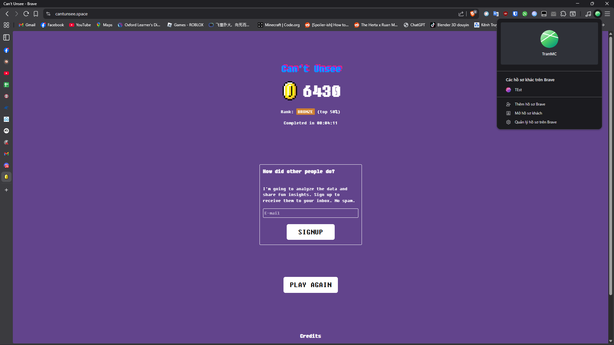

# Kiểm Thử Phần Mềm - SOFT4003

## Giới thiệu
Dự án này chứa các tài liệu và mã nguồn, bài tập liên quan đến môn học **Kiểm thử phần mềm (SOFT4003)**.


## Bài 1: Nguyên lí của kiểm thử
- Đường dẫn tới trang bài tập: [Can't Unsee](https://cantunsee.space/)
- Số lần làm: 03
- Ngày thực hiện: 5/1/2026




---
## Bài 2: Quy trình kiểm thử
### Mô tả bài toán

#### StudentAnalyzer
Chương trình phân tích điểm số của sinh viên với các chức năng:

1. **countExcellentStudents**: Đếm số lượng sinh viên xuất sắc (điểm >= 8.0)
   - Chỉ tính các điểm hợp lệ trong khoảng [0, 10]
   - Bỏ qua các giá trị null hoặc ngoài phạm vi

2. **calculateValidAverage**: Tính điểm trung bình của các điểm hợp lệ
   - Chỉ tính các điểm trong khoảng [0, 10]
   - Bỏ qua các giá trị null hoặc ngoài phạm vi
   - Trả về 0 nếu không có điểm hợp lệ

### Công nghệ sử dụng

| Công nghệ | Mô tả |
|-----------|-------|
| Java | Ngôn ngữ lập trình chính |
| Maven | Công cụ quản lý dự án và phụ thuộc |
| JUnit 5 | Thư viện kiểm thử đơn vị |

## Cách chạy chương trình

#### Yêu cầu hệ thống
- Java Development Kit (JDK) phiên bản 8 trở lên
- Maven phiên bản 3.6 trở lên

#### Bước chuẩn bị

1. **Cài đặt Java JDK**
   - Tải và cài đặt JDK từ trang chính thức của Oracle hoặc sử dụng phiên bản mã nguồn mở như OpenJDK
   - Thiết lập biến môi trường `JAVA_HOME` để chỉ tới thư mục cài đặt JDK

2. **Cài đặt Maven**

   **Cách 1: Cài đặt thủ công (tất cả hệ điều hành)**
   - Tải Maven từ https://maven.apache.org/
   - Giải nén file và lưu vào thư mục yêu thích
   - Thiết lập biến môi trường `MAVEN_HOME` để chỉ tới thư mục Maven
   - Thêm `%MAVEN_HOME%\bin` (Windows) hoặc `$MAVEN_HOME/bin` (Linux/Mac) vào biến `PATH`

   **Cách 2: Sử dụng Chocolatey (Windows - khuyến nghị)**
   - Mở CMD với quyền quản trị viên (nếu chưa có Chocolatey):
     ```bash
     winget install -e --id Chocolatey.Chocolatey
     ```
   - Cài đặt Maven:
     ```bash
     choco install maven
     ```

3. **Kiểm tra cài đặt**
   ```bash
   java -version
   mvn -version
   ```
---
#### Tải dự án
```bash
git clone <đường-dẫn-repo>
cd unit-test
```

#### Biên dịch dự án
```bash
mvn clean compile
```

#### Chạy tất cả ca kiểm thử
```bash
mvn test
```

#### Chạy kiểm thử cụ thể
```bash
mvn test -Dtest=StudentAnalyzerTest #testCountExcellentStudents_normalCase
```

#### Xem kết quả kiểm thử
Kết quả chi tiết được lưu trong thư mục: `unit-test/target/surefire-reports/`
- File báo cáo XML: `TEST-StudentAnalyzerTest.xml`
- File báo cáo text: `StudentAnalyzerTest.txt`

### Chi tiết các ca kiểm thử

| Tên kiểm thử | Mô tả |
|-------------|-------|
| testCountExcellentStudents_normalCase | Đếm sinh viên xuất sắc với dữ liệu hỗn hợp |
| testCountExcellentStudents_allValid | Đếm khi tất cả điểm đều hợp lệ |
| testCountExcellentStudents_emptyList | Đếm với danh sách rỗng |
| testCalculateValidAverage_mixedValues | Tính trung bình với giá trị hỗn hợp |
| testCalculateValidAverage_boundaryValues | Tính trung bình với giá trị biên |
| testCalculateValidAverage_emptyList | Tính trung bình với danh sách rỗng |

---
<p align="center"> © 2026 TranMC</p>

