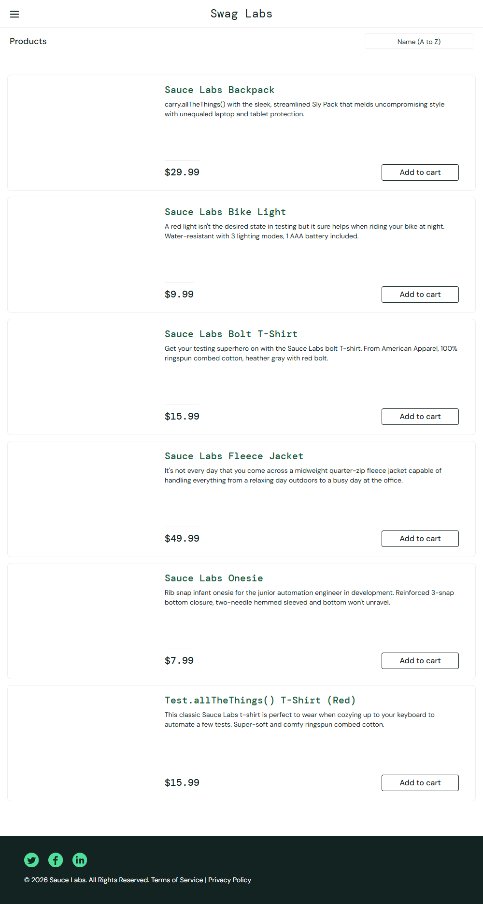
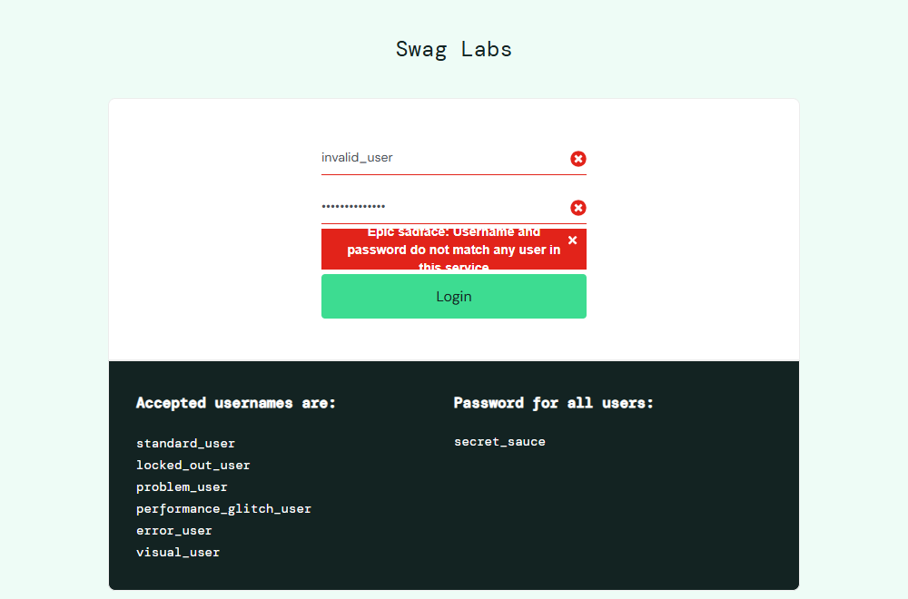
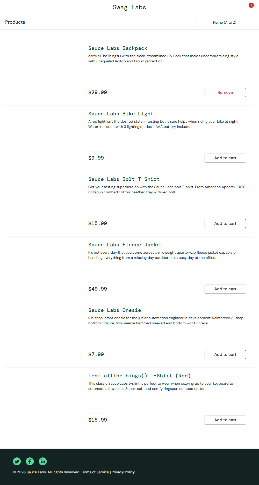
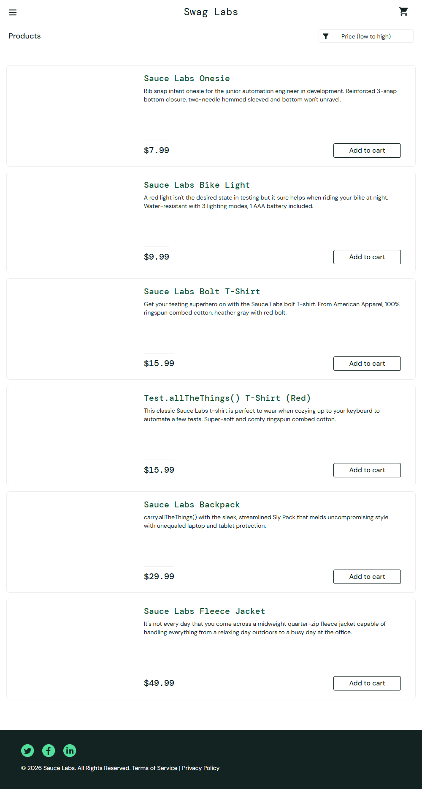
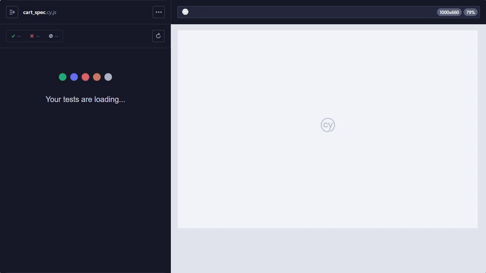

# Kiểm Thử Phần Mềm - SOFT4003
> [!NOTE]
> **Sinh viên thực hiện:** Trần Việt Anh 
>
> **MSSV:** BCS230111 
>
> **Lớp:** 23CS-GM

Dự án tập trung vào các bài tập và ứng dụng thực tế về kiểm thử phần mềm, bao gồm kiểm thử đơn vị, kiểm thử tĩnh, và kiểm thử tự động End-to-End.

---

## Mục Lục

1. [Bài 1: Nguyên lí của Kiểm Thử](#bài-1-nguyên-lí-của-kiểm-thử)
2. [Bài 2: Quy Trình Kiểm Thử - Unit Test](#bài-2-quy-trình-kiểm-thử---unit-test)
3. [Bài 3: Kiểm Thử Tự Động - Cypress](#bài-3-kiểm-thử-tự-động---cypress)
---


## Bài 1: Nguyên Lí Của Kiểm Thử

**Mục tiêu:** Hiểu rõ các nguyên lí cơ bản trong kiểm thử phần mềm thông qua bài tập tương tác.

| Thông tin | Chi tiết |
|-----------|---------|
| Đường dẫn bài tập | [Can't Unsee](https://cantunsee.space/) |
| Số lần thực hiện | 3 |
| Ngày thực hiện | 05/01/2026 |


---

## Bài 2: Quy Trình Kiểm Thử - Unit Test

### Mô Tả Bài Toán

#### Script StudentAnalyzer.js dùng để phân tích điểm số học sinh với hai chức năng chính:

**1. countExcellentStudents** 
- Đếm sinh viên xuất sắc
- Đếm số sinh viên có điểm ≥ 8.0
- Chỉ xử lý các giá trị hợp lệ trong khoảng [0, 10]
- Bỏ qua giá trị trống `(null)` hoặc ngoài phạm vi

**2. calculateValidAverage** 
- Tính điểm trung bình
- Tính trung bình của các điểm hợp lệ trong [0, 10]
- Bỏ qua giá trị trống `(null)` hoặc không hợp lệ
- Trả về 0 nếu không có điểm nào hợp lệ

### Công Nghệ Sử Dụng

| Công Nghệ | Phiên Bản | Mô Tả |
|-----------|----------|-------|
| Java | 8+ | Ngôn ngữ lập trình chính |
| Maven | 3.6+ | Công cụ quản lý dự án và phụ thuộc |
| JUnit | 5 | Framework kiểm thử đơn vị |

### Hướng Dẫn Chạy Chương Trình

#### Yêu Cầu Hệ Thống

- **Java Development Kit (JDK)** phiên bản 8 trở lên
- **Maven** phiên bản 3.6 trở lên

#### Bước Chuẩn Bị

**1. Cài Đặt Java JDK**
- Tải JDK từ [Oracle](https://www.oracle.com/java/technologies/downloads/) hoặc [OpenJDK](https://openjdk.java.net/)
- Cài đặt và thiết lập biến môi trường `JAVA_HOME`

**2. Cài Đặt Maven**

**Cách 1: Cài đặt thủ công (tất cả hệ điều hành)**
- Tải từ https://maven.apache.org/
- Giải nén và lưu vào thư mục yêu thích
- Thiết lập biến `MAVEN_HOME`
- Thêm `%MAVEN_HOME%\bin` (Windows) hoặc `$MAVEN_HOME/bin` (Linux/Mac) vào `PATH`

**Cách 2: Sử dụng Chocolatey (Windows)**
```bash
winget install -e --id Chocolatey.Chocolatey
choco install maven
```

**3. Kiểm Tra Cài Đặt**
```bash
java -version
mvn -version
```
---

#### Tải và Chạy Dự Án

**Tải dự án**
```bash
git clone <đường-dẫn-repo>
cd unit-test
```

**Biên Dịch Dự Án**
```bash
mvn clean compile
```

**Chạy Tất Cả Ca Kiểm Thử**
```bash
mvn test
```

**Chạy Kiểm Thử Cụ Thể**
```bash
mvn test -Dtest=StudentAnalyzerTest #testCountExcellentStudents_normalCase
```

**Xem Kết Quả Kiểm Thử**

Báo cáo chi tiết được lưu tại: `unit-test/target/surefire-reports/`

| File | Mô Tả |
|------|-------|
| `TEST-StudentAnalyzerTest.xml` | Báo cáo XML |
| `StudentAnalyzerTest.txt` | Báo cáo text |

### Danh Sách Ca Kiểm Thử

| Tên Ca Kiểm Thử | Mô Tả |
|----------------|-------|
| `testCountExcellentStudents_normalCase` | Đếm sinh viên xuất sắc với dữ liệu hỗn hợp |
| `testCountExcellentStudents_allValid` | Đếm khi tất cả điểm đều hợp lệ |
| `testCountExcellentStudents_emptyList` | Đếm với danh sách rỗng |
| `testCalculateValidAverage_mixedValues` | Tính trung bình với giá trị hỗn hợp |
| `testCalculateValidAverage_boundaryValues` | Tính trung bình với giá trị biên |
| `testCalculateValidAverage_emptyList` | Tính trung bình với danh sách rỗng |

---

## Bài 3: Kiểm Thử Tự Động - Cypress

Kiểm thử tự động End-to-End cho ứng dụng web sử dụng Cypress framework.

### Cài Đặt Cypress

#### Yêu Cầu

- [Node.js](https://nodejs.org/) phiên bản 14+
- Một trình soạn thảo hỗ trợ (VS Code, WebStorm, v.v.)

#### Các Bước Cài Đặt

**1. Tạo Thư Mục Dự Án**
```bash
mkdir cypress-exercise
cd cypress-exercise
npm init -y
```

**2. Cài Đặt Cypress**
```bash
npm install cypress --save-dev
```

**3. Khởi Động Cypress**
```bash
npx cypress open
```

### Kịch Bản Kiểm Thử

#### 1. Đăng Nhập Thành Công

**Mục tiêu:** Xác minh chức năng đăng nhập với thông tin hợp lệ

**Các bước thực hiện:**
- Truy cập https://www.saucedemo.com
- Nhập tên đăng nhập: `standard_user`
- Nhập mật khẩu: `secret_sauce`
- Click nút "Login"
- Xác minh: URL chứa `/inventory.html`



---

#### 2. Đăng Nhập Thất Bại

**Mục tiêu:** Kiểm tra thông báo lỗi khi đăng nhập sai

**Các bước thực hiện:**
- Truy cập https://www.saucedemo.com
- Nhập tên đăng nhập: `invalid_user`
- Nhập mật khẩu: `wrong_password`
- Click nút "Login"
- Xác minh: Hiển thị lỗi "Username and password do not match"



---

#### 3. Thêm Sản Phẩm Vào Giỏ Hàng

**Mục tiêu:** Kiểm tra chức năng thêm sản phẩm vào giỏ

**Các bước thực hiện:**
- Đăng nhập: `standard_user/secret_sauce`
- Click "Add to cart" cho sản phẩm đầu tiên
- Xác minh: Badge giỏ hàng hiển thị số "1"



---

#### 4. Lọc Sản Phẩm Theo Giá

**Mục tiêu:** Kiểm tra bộ lọc và sắp xếp sản phẩm

**Các bước thực hiện:**
- Đăng nhập với thông tin hợp lệ
- Chọn bộ lọc "Price (low to high)"
- Xác minh: Sản phẩm đầu tiên có giá thấp nhất



---

#### 5. Xóa Sản Phẩm Khỏi Giỏ Hàng

**Mục tiêu:** Kiểm tra chức năng xóa sản phẩm trong giỏ

**Các bước thực hiện:**
- Đăng nhập: `standard_user/secret_sauce`
- Click "Add to cart" cho sản phẩm đầu tiên
- Xác minh: Badge giỏ hàng hiển thị số "1"
- Click "Remove"
- Xác minh: Badge giỏ hàng biến mất



---

#### 6. Quy Trình Thanh Toán Hoàn Chỉnh

**Mục tiêu:** Kiểm thử luồng thanh toán từ đầu đến cuối

**Các bước thực hiện:**
- Đăng nhập: `standard_user/secret_sauce`
- Thêm sản phẩm đầu tiên vào giỏ
- Click vào icon giỏ hàng
- Click "Checkout"
- Điền thông tin:
  - First Name: `John`
  - Last Name: `Doe`
  - Zip: `12345`
- Click "Continue"
- Xác minh: URL chứa `/checkout-step-two.html`


---

<p align="center">© 2026 TranMC</p>

